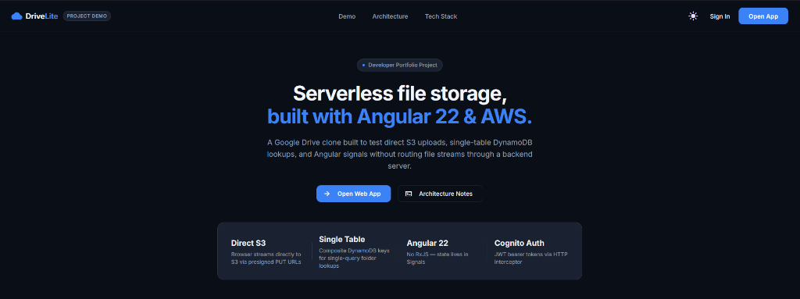
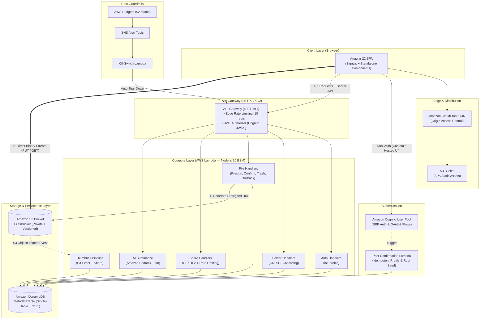
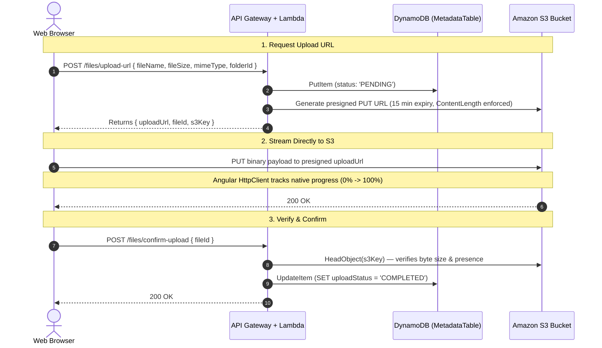

# Drive Lite

A personal cloud storage drive built to run within the AWS Free Tier with **$0/month fixed infrastructure costs**. Built with Angular 22, AWS Lambda (Node.js 20 ESM), Amazon DynamoDB (single-table design), and S3.

[Architecture & ADRs](docs/architecture.md) • [API Route Matrix](docs/api-routes-and-communication-matrix.md) • [Backend Handlers](docs/backend-handlers-and-architecture.md) • [Frontend Guide](docs/frontend-components-and-architecture.md)



---

## Why I Built This

Most file-drive tutorials follow a standard template: spin up an Express or NestJS server on EC2/ECS, proxy file streams directly through the API into S3, and hook it up to a managed PostgreSQL instance.

That approach works for simple apps, but it falls apart quickly on a serverless budget:
1. **API Gateway has a hard 10 MB payload limit** on HTTP APIs.
2. **Lambda charges for idle network time**: streaming a 500 MB file through Lambda compute wastes execution time while waiting on client network bandwidth.
3. **Always-on databases are expensive**: an idle RDS or Aurora Serverless v2 instance adds ~$15–$30 every month even with zero active traffic.

I built **Drive Lite** with one rule: **stay at $0 fixed monthly cost without skipping core backend logic** (rate limiting, upload verification, cascading deletes, and secure share links).

---

## Architecture Overview

The browser uploads and downloads files directly to S3 via presigned URLs. API Gateway and Lambda only handle metadata queries against a single DynamoDB table.



---

## 3-Phase Upload Flow

To keep Lambda execution times around ~70ms and bypass API Gateway's 10 MB limit, file uploads follow a 3-step flow:



- **Phase 1 (Presign & Register)**: Client requests a pre-signed `PUT` URL. Lambda validates user quotas, stores a `PENDING` record in DynamoDB, and returns the S3 upload URL with a strict `Content-Length` restriction.
- **Phase 2 (Direct Upload)**: The browser streams raw bytes straight to S3 using Angular's `HttpClient`, capturing real-time progress events for the UI.
- **Phase 3 (Integrity Verification)**: On upload complete, the client notifies the backend. A lightweight Lambda runs `HeadObject` on S3 to verify the file was actually written with the exact expected byte count before flipping the status to `COMPLETED`.

---

## Engineering Decisions & Trade-offs

### 1. In-Browser ZIP Archiving (Web Workers) vs. Lambda
Creating multi-file ZIP downloads on the backend requires streaming multiple objects from S3 into Lambda memory, buffering the compressed archive, and streaming it back out. That burns Lambda execution time, risks memory exhaustion on large directories, and doubles S3 egress costs.
- **Solution**: The frontend requests parallel presigned `GET` URLs and streams each file directly to the browser, assembling the `.zip` in a dedicated Web Worker via `JSZip`.

### 2. DynamoDB Atomic Rate Limiting vs. AWS WAF
AWS WAF is the standard recommendation for API rate limiting, but it charges ~$5.00/month baseline plus per-rule fees—violating the zero-fixed-cost goal.
- **Solution**: For public password-protected share links, rate limiting is handled in DynamoDB using atomic `ADD` operations on time-bucketed partition keys (`RATELIMIT#<ip>#WINDOW#<minute>`) with automatic TTL cleanups.

### 3. CodeMirror 6 vs. Monaco Editor
Monaco (VS Code's editor) adds roughly ~4 MB to the initial bundle.
- **Solution**: Replaced it with CodeMirror 6 with tree-shaken language extensions (TypeScript, JSON, Markdown, HTML/CSS). The entire code editing feature bundle came in under 200 KB while supporting shortcuts (`Ctrl+S`), line numbers, and theme switching.

### 4. Custom Reactive Forms vs. `@aws-amplify/ui-angular`
The default `@aws-amplify/ui-angular` package brings in heavy pre-built styles and components that clashed with custom Material theme tokens and added ~350 KB.
- **Solution**: Kept `@aws-amplify/auth` core methods (`signIn`, `signUp`, `confirmSignUp`) wrapped inside Angular Reactive Forms and custom Signal-based state management.

---

## DynamoDB Single-Table Schema

All entities (users, folders, files, trash, shared links) map to a single DynamoDB table. Every access pattern hits a single `GetItem` or `Query` — no scans:

| Access Pattern | Primary Key (`PK`) | Sort Key (`SK`) | Index Key (`GSI1PK`) | Index Key (`GSI1SK`) | DynamoDB Operation |
|:---|:---|:---|:---|:---|:---|
| **Get User Profile** | `USER#{userId}` | `PROFILE` | — | — | `GetItem` |
| **List Folders** | `USER#{userId}` | `FOLDER#{folderId}` | `USER#{userId}` | `FOLDER#{folderId}` | `Query (begins_with)` |
| **List Files in Folder** | `USER#{userId}#FOLDER#{folderId}` | `FILE#{fileId}` | `USER#{userId}` | `FILE#{fileId}` | `Query (begins_with)` |
| **Get File by ID** | — | — | `USER#{userId}` | `FILE#{fileId}` | `Query (GSI1)` |
| **List Recent Files** | — | — | `USER#{userId}` | `FILE#{fileId}` | `Query (GSI1, ScanIndexForward: false)` |
| **List Trash Items** | `TRASH#{userId}` | `FILE#{fileId}` | — | — | `Query (begins_with)` |
| **Public Share Lookup** | `SHARE#{token}` | `METADATA` | `USER#{userId}` | `SHARE#{token}` | `GetItem` |
| **IP Rate Limiting** | `RATELIMIT#{ip}` | `WINDOW#{epochMin}` | — | — | `UpdateItem (ADD counter)` |

---

## Practical Challenges & How They Were Solved

- **Handling Abandoned Uploads**: If a client requests a presigned URL but drops connection before uploading, DynamoDB is left with an unverified `PENDING` record. Solved by attaching a 24-hour TTL attribute to pending records and enabling an S3 Lifecycle Rule that automatically aborts incomplete multipart uploads.
- **Cascading Folder Deletions**: Deleting a folder with nested subdirectories requires updating all children without partial failures. The delete handler recursively resolves descendant file/folder IDs and executes the state transition to `TRASH` in atomic batches (`TransactWriteItems`).
- **Timing-Safe Password Verification**: Password-protected public share links use PBKDF2 (SHA-256) with `crypto.timingSafeEqual` to eliminate timing side-channel attacks during password evaluation.

---

## Features

- Nested directories, multi-item selection (`Ctrl`/`Shift`), breadcrumb navigation, drag-and-drop dropzone.
- Native image/audio/video previewers, PDF viewer, in-browser code editor (CodeMirror 6).
- Text document summaries via Amazon Bedrock (Titan model).
- Expiring share links with optional password protection and view count limits.
- Soft delete with restore and S3 object version rollback.
- `Ctrl+K` command palette — debounced search with keyword hit highlighting.

---

## Monorepo Layout

```
drive_lite/
├── frontend/          # Angular 22 SPA (Signals, Standalone Components, Material)
├── backend/           # AWS Lambda Handlers (Node.js 20 ESM, TypeScript, Vitest)
├── infra/             # AWS CDK v2 Infrastructure (TypeScript)
├── docs/              # Deep-dive architecture ADRs, API matrices, and handler specs
└── docker-compose.yml # LocalStack + Cognito local emulation
```

---

## Local Setup

### Prerequisites
- **Node.js** `>= 22.22.3` (Pinned in `.nvmrc`)
- **Docker Desktop** (For LocalStack)
- **AWS CLI v2** & **AWS CDK** (`npm install -g aws-cdk`)

### 1. Run Locally with LocalStack

```bash
# Clone & install dependencies
git clone https://github.com/Carmine12328/drive-lite.git
cd drive_lite
npm install

# Start LocalStack & Cognito emulator
docker compose up -d

# Deploy CDK constructs locally & seed test users
cd infra
npm run deploy:local
npm run setup:cognito

# Start the Angular dev server
cd ..
npm run dev
```

Open `http://localhost:4200`.

### 2. Deploy to AWS

```bash
# Configure credentials
aws configure

# Deploy infrastructure stack
cd infra
npm run deploy

# Configure environment & build frontend
npm run configure:env
cd ../frontend
npm run build --configuration production

# Upload assets to S3 & invalidate CloudFront cache
npm run deploy:frontend
```

---

## Testing & Quality Checks

```bash
# Backend unit & integration tests (Vitest)
npm run test -w @drive-lite/backend

# CDK infrastructure tests
npm run test -w @drive-lite/infra

# Lint & build check
npm run lint
npm run build
```

---

## License

[MIT](LICENSE)
