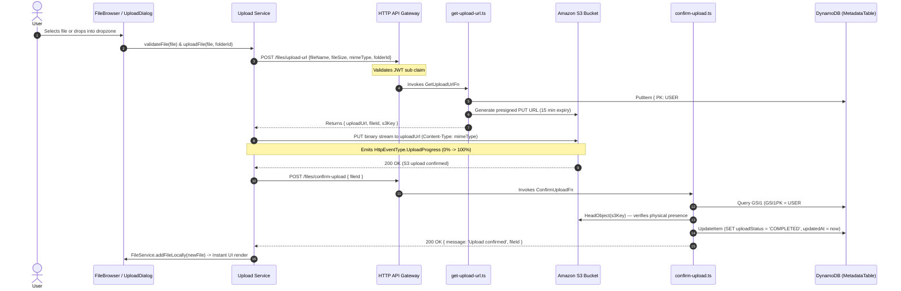
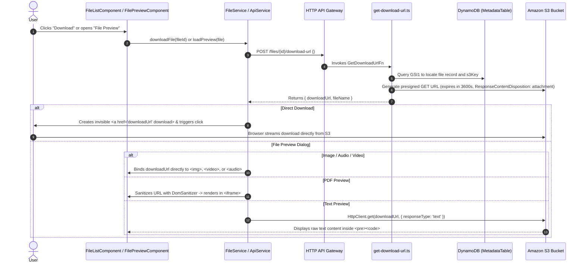
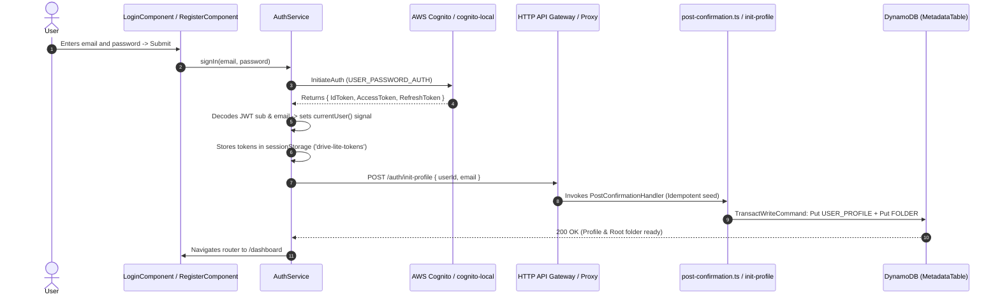
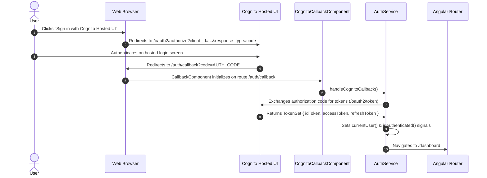
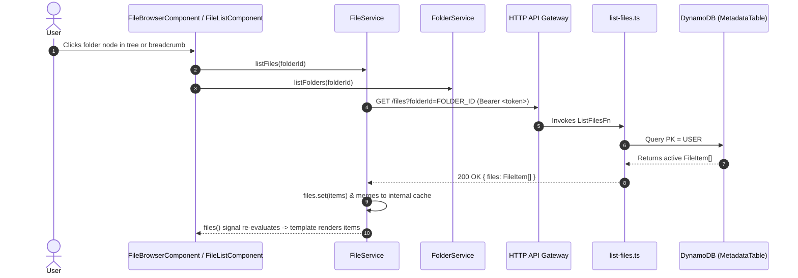
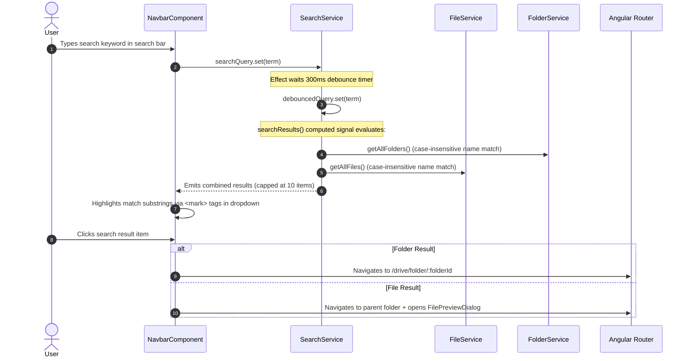
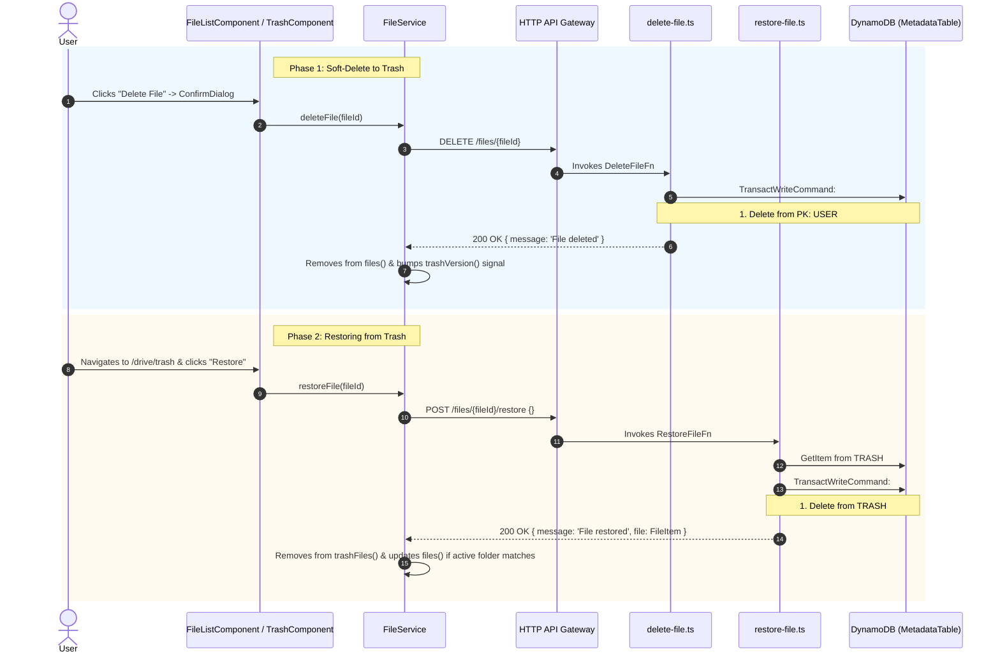
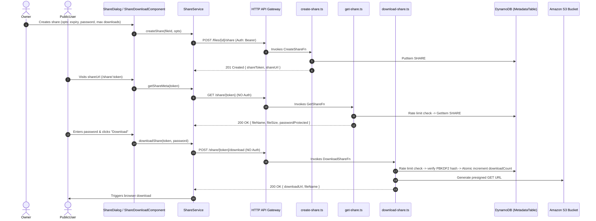
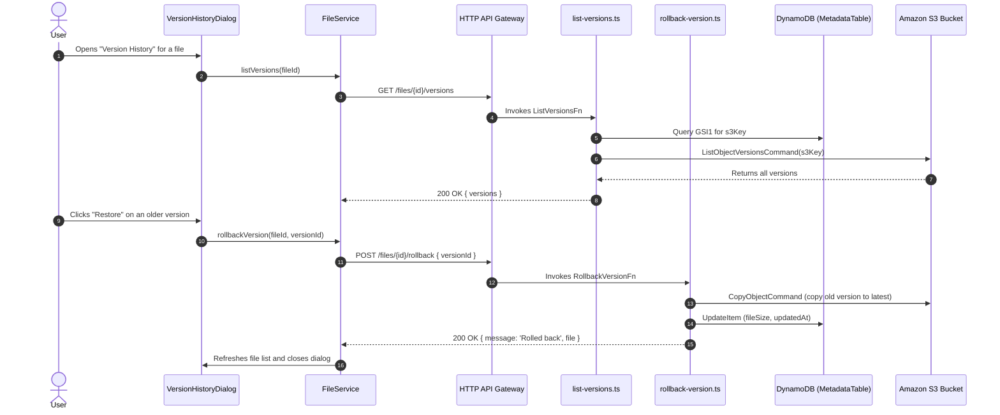
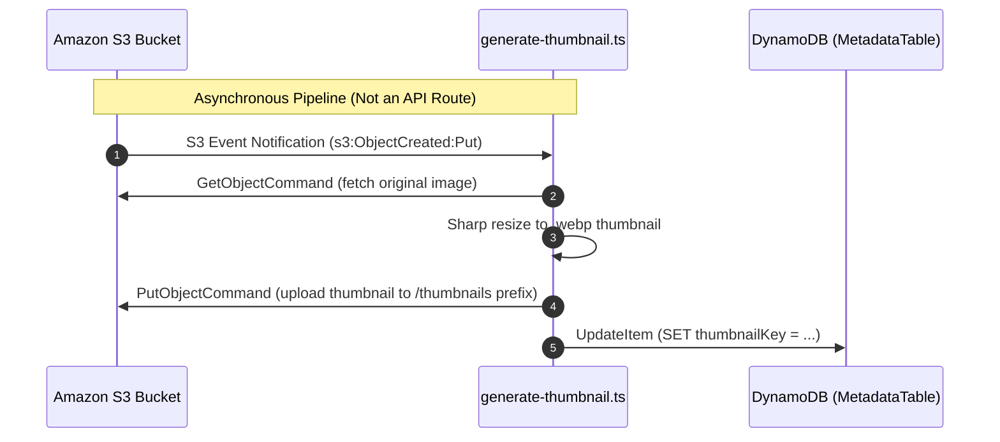

# Architecture Decisions & Infrastructure Specification — Drive Lite

This document details the core architectural decisions, complete AWS CDK infrastructure constructs, and end-to-end runtime data-flow diagrams for Drive Lite.

---

## 1. Architectural Decision Records (ADRs)

### 1.1. Presigned URLs over Lambda Proxy Uploads
- **Decision**: Use S3 presigned URLs for file uploads and downloads rather than streaming file binaries through API Gateway and Lambda.
- **Rationale**:
  - AWS Lambda has a strict 6 MB synchronous payload limit (and API Gateway enforces a 10 MB payload limit), making direct proxying infeasible for media and large documents.
  - Presigned URLs offload heavy I/O directly to Amazon S3, eliminating compute bottlenecks and reducing Lambda concurrency and execution duration to milliseconds.
  - Supports direct browser-to-S3 uploads up to 5 GB with a single HTTP `PUT`.
  - Enforces least-privilege security: upload URLs expire after 15 minutes (900s) and download URLs expire after 1 hour (3600s).

### 1.2. Single-Table DynamoDB Design
- **Decision**: Persist all metadata entities (user profiles, folders, active files, and soft-deleted trash items) within a single DynamoDB table (`MetadataTable`).
- **Rationale**:
  - Minimizes provisioned infrastructure and billing boundaries.
  - Enables atomic multi-item operations (e.g. `TransactWriteCommand` for soft-deleting files and batch cascading folder deletions).
  - All application access patterns (folder listing, file lookup, cross-folder search, recent files, trash management) are satisfied with a single table and one Global Secondary Index (`GSI1`).

### 1.3. HTTP API over REST API (API Gateway v2)
- **Decision**: Provision Amazon API Gateway HTTP API (`HttpApi`) rather than a REST API.
- **Rationale**:
  - Up to 71% cost reduction and significantly lower latency compared to REST APIs.
  - Native, first-class OpenID Connect / OAuth2 JWT Authorizer support with automatic Cognito User Pool JWKS verification, removing the need for custom Lambda authorizers.
  - Clean CORS configuration and lightweight proxy routing.

### 1.4. Dual Authentication Flow
- **Decision**: Implement both Custom Angular Reactive Forms (SRP authentication via AWS Amplify / AWS SDK) and Cognito Hosted UI (OAuth2 Authorization Code Grant).
- **Rationale**:
  - **Custom Forms**: Offers pixel-perfect branding, custom 2-step registration with real-time password strength metering, and inline verification code advancement.
  - **Hosted UI**: Enables zero-code managed authentication and seamless social identity federation.
  - Both flows yield identical Cognito JWT ID tokens and Access tokens validated seamlessly by the same API Gateway JWT Authorizer.

### 1.5. LocalStack for Local Development
- **Decision**: Emulate AWS services (DynamoDB, S3, Cognito via `cognito-local`) locally using Docker and LocalStack.
- **Rationale**:
  - Enables full-fidelity offline development and testing with zero cloud costs.
  - High-speed dev iteration without CloudFormation deploy latency.
  - Paired with `backend/src/local-api.ts` to bridge Express with Lambda handlers and automatically rewrite Docker-internal S3 URLs for host browser access.

### 1.6. Public Share Endpoint Security
- **Decision**: Expose 2 unauthenticated routes (`GET /share/{token}`, `POST /share/{token}/download`) secured by 256-bit cryptographic tokens, DynamoDB rate limiting, PBKDF2 password hashing, and brute-force lockout instead of WAF.
- **Rationale**:
  - A WAF would incur baseline costs that exceed the $0/month budget.
  - Defense-in-depth via application-level rate limiting (DynamoDB atomic counters + TTL), PBKDF2 (zero dependency), and anti-enumeration generic errors safely protects the endpoints at zero added cost.

### 1.7. Stub AI Summarization
- **Decision**: Ship Feature 8 as a stub returning document preview (first 500 chars) for portfolio demonstration.
- **Rationale**:
  - Real Bedrock calls cost money.
  - The architecture includes an opt-in `BEDROCK_ENABLED` environment variable for real AWS deployments.

### 1.8. Client-Side ZIP Generation
- **Decision**: Use browser-side `jszip` for batch downloads instead of a server-side ZIP Lambda.
- **Rationale**:
  - Saves Lambda execution time and memory limits.
  - Eliminates server-side S3 egress costs to build the ZIP, leveraging the client's connection instead.

### 1.9. CodeMirror 6 over Monaco Editor
- **Decision**: Use CodeMirror 6 for the in-browser text and markdown editor.
- **Rationale**:
  - CodeMirror is lightweight (~100KB gzipped) and tree-shakeable.
  - Matches the 'lite' philosophy much better than Monaco Editor (~4MB).

---

## 2. Infrastructure & CDK Constructs Specification

The cloud infrastructure is provisioned with AWS CDK v2 (`infra/lib/`) organized into modular constructs composed in `DriveLiteStack`.

```
infra/lib/
├── drive-lite-stack.ts       # Root Stack composing all constructs & stack outputs
├── storage-construct.ts      # S3 FilesBucket + DynamoDB single-table
├── auth-construct.ts         # Cognito User Pool + Web Client (SPA)
├── api-construct.ts          # HTTP API Gateway + 17 Lambda functions + IAM grants + Rate Limiting
├── frontend-construct.ts     # S3 HostingBucket + CloudFront Distribution (OAC)
└── budget-construct.ts       # AWS Monthly Budget ($2.50) + SNS Topic + Kill-Switch Lambda
```

### 2.1. Root Stack: `DriveLiteStack` (`infra/lib/drive-lite-stack.ts`)
Composes all constructs in strict dependency order:
1. **`StorageConstruct`**: Creates DynamoDB table and S3 files bucket.
2. **`AuthConstruct`**: Creates Cognito User Pool (instantiated prior to API so JWT Authorizer can reference the User Pool ID).
3. **`ApiConstruct`**: Creates HTTP API Gateway (with 10 req/s rate limiting), Lambda functions, IAM role bindings, and routes.
4. **Cognito Trigger Binding**: Invokes `auth.addPostConfirmationTrigger(api.postConfirmationHandler)` to wire the post-confirmation Lambda.
5. **`FrontendConstruct`**: Creates S3 static website hosting bucket and CloudFront distribution (conditionally skipped when `localstack=true`).
6. **`BudgetConstruct`**: Creates AWS Monthly Budget ($2.50 limit), SNS cost alerts to `carmine12328@gmail.com`, and automated Kill-Switch Lambda.

#### Cost Protection: 3-Layer Architecture
1. **Layer 1: Edge Rate Limiting**: `ApiConstruct` configures `defaultRouteSettings` on API Gateway with `throttlingRateLimit: 10` req/s and `throttlingBurstLimit: 20` req/s. Excessive bot traffic is rejected with HTTP 429 for $0.
2. **Layer 2: AWS Monthly Budget**: `BudgetConstruct` provisions an `AWS::Budgets::Budget` capped at $2.50 USD/month. Sends email alerts at 80% ($2.00) actual spend and 100% ($2.50) forecasted spend.
3. **Layer 3: Automated Kill-Switch**: Upon reaching 100% actual budget breach ($2.50), AWS Budgets publishes to an SNS topic that invokes `kill-switch.ts`, issuing an automated `cloudformation:DeleteStack` to tear down all resources and guarantee zero ongoing charges.

#### Context Flags & Environment Modes
- `localstack=true`: Forces dev mode and skips CloudFront provisioning.
- `skipCloudFront=true`: Skips CloudFront/Frontend bucket provisioning (useful for accounts awaiting CloudFront verification or local-frontend + live-backend setups).
- `dev=true`: Applies `RemovalPolicy.DESTROY` and `autoDeleteObjects: true` on S3 buckets and DynamoDB tables.
- **Production (default)**: Applies `RemovalPolicy.RETAIN` on storage resources.

#### CloudFormation Stack Outputs
| Output Name | Source Attribute | Description |
|:---|:---|:---|
| `ApiUrl` | `api.api.url` | HTTP API Gateway base endpoint |
| `UserPoolId` | `auth.userPool.userPoolId` | Cognito User Pool ID |
| `UserPoolClientId` | `auth.userPoolClient.userPoolClientId` | Cognito App Client ID |
| `TableName` | `storage.table.tableName` | Metadata DynamoDB table name |
| `BucketName` | `storage.bucket.bucketName` | Binary storage S3 bucket name |
| `HostingBucketName` | `frontend.hostingBucket.bucketName` | Frontend S3 hosting bucket name |
| `WebsiteUrl` | `frontend.websiteUrl` | Public website URL (S3 website endpoint or CloudFront) |
| `CloudFrontUrl` | `https://${frontend.distribution.distributionDomainName}` | Public CloudFront CDN domain URL |
| `CloudFrontDistributionId` | `frontend.distribution.distributionId` | CloudFront distribution ID for cache invalidation |

---

### 2.2. CI/CD Pipeline Automation (GitHub Actions)

Drive Lite uses a dual GitHub Actions workflow architecture in `.github/workflows/`:

1. **Pull Request & Branch Validation (`ci.yml`)**:
   - Triggers on pull requests targeting `main` and pushes to feature branches.
   - Executes `npm ci` with npm cache, `.angular/cache` zstd build cache, workspace linting, Vitest backend unit tests, CDK infrastructure snapshot tests, and full Angular production build verification.
2. **Continuous Deployment (`deploy.yml`)**:
   - Triggers on direct push to `main` and manual `workflow_dispatch`.
   - Authenticates to AWS via **AWS OIDC Role assumption** (`role-to-assume: ${{ secrets.AWS_ROLE_ARN }}`) or standard IAM Access Keys.
   - Provisions CDK infrastructure via `cdk deploy DriveLiteStack --outputs-file cdk-outputs.json`.
   - Runs `scripts/configure-environment.mjs` to dynamically inject stack outputs into `frontend/src/environments/environment.prod.ts`.
   - Compiles Angular SPA and syncs static assets to S3 hosting bucket with differential caching (`max-age=31536000, immutable` on hashed chunks, `no-cache` on `index.html`).
   - Automatically invalidates CloudFront CDN cache upon completion.
   - Publishes a deployment summary to GitHub Actions `$GITHUB_STEP_SUMMARY`.

### 2.3. Storage Construct: `StorageConstruct` (`infra/lib/storage-construct.ts`)

#### S3 Files Bucket (`FilesBucket`)
- **Access**: `BlockPublicAccess.BLOCK_ALL` (all public read/write blocked).
- **Encryption**: `BucketEncryption.S3_MANAGED` (SSE-S3 AES-256).
- **Security**: `enforceSSL: true` (rejects non-HTTPS requests).
- **Versioning**: `versioned: true`.
- **CORS Configuration**:
  - Allowed Origins: `http://localhost:4200`
  - Allowed Methods: `PUT`, `GET`, `HEAD`
  - Allowed Headers: `*`
  - Max Age: 3600 seconds (1 hour)
- **Lifecycle Rules**:
  - `abortIncompleteMultipartUploadAfter: Duration.days(7)`
  - `noncurrentVersionExpiration: Duration.days(30)`
- **Removal Policy**: `DESTROY` with `autoDeleteObjects: true` (dev) / `RETAIN` (prod).

#### DynamoDB Single-Table (`MetadataTable`)
- **Table Structure**:
  - Partition Key (`PK`): `String`
  - Sort Key (`SK`): `String`
- **Billing Mode**: `Billing.onDemand()` (`PAY_PER_REQUEST`).
- **Time To Live (TTL)**: Enabled on attribute `ttl` (Unix timestamp in seconds for automatic 30-day trash purging).
- **Global Secondary Index (`GSI1`)**:
  - Partition Key (`GSI1PK`): `String`
  - Sort Key (`GSI1SK`): `String`
  - Projection: `ALL` (allows cross-partition lookups without table re-queries).

---

### 2.4. Authentication Construct: `AuthConstruct` (`infra/lib/auth-construct.ts`)

#### Cognito User Pool (`drive-lite-user-pool`)
- **Sign-In / Sign-Up**: `selfSignUpEnabled: true`, `signInAliases: { email: true }`, `autoVerify: { email: true }`.
- **Required Standard Attributes**: `email` (required, mutable).
- **Password Policy**:
  - Minimum length: 8 characters
  - Requires uppercase, lowercase, numbers, and special symbols
- **Account Recovery**: `AccountRecovery.EMAIL_ONLY`.

#### Cognito Web Client (`drive-lite-web-client`)
- **Client Security**: `generateSecret: false` (public SPA client).
- **Auth Flows**: `userSrp: true` (Secure Remote Password protocol).
- **OAuth 2.0 Configuration**:
  - Allowed Flows: `authorizationCodeGrant: true`
  - Scopes: `OPENID`, `EMAIL`, `PROFILE`
  - Callback URLs: `http://localhost:4200/auth/callback`
  - Logout URLs: `http://localhost:4200`

---

### 2.5. API Gateway Construct: `ApiConstruct` (`infra/lib/api-construct.ts`)

#### HTTP API Gateway (`drive-lite-api`)
- **CORS Preflight**:
  - Allowed Origins: `http://localhost:4200`
  - Allowed Methods: `GET`, `POST`, `PUT`, `PATCH`, `DELETE`, `OPTIONS`
  - Allowed Headers: `Content-Type`, `Authorization`
  - Max Age: 1 hour
- **JWT Authorizer (`CognitoAuthorizer`)**:
  - Issuer: `https://cognito-idp.${region}.amazonaws.com/${userPoolId}`
  - Audience: `[userPoolClientId]`
  - Applied across all API routes.

#### Lambda Function Defaults (`createHandler`)
- **Runtime**: `NODEJS_20_X`
- **Memory Size**: 256 MB
- **Timeout**: 30 seconds (configurable)
- **Bundling**: ESM output format (`OutputFormat.ESM`), banner injection for `createRequire`, externalized `@aws-sdk/*` modules.
- **Environment Variables**:
  - `TABLE_NAME`: Target DynamoDB table name
  - `BUCKET_NAME`: Target S3 bucket name
  - `REGION`: AWS Region
  - `ALLOWED_ORIGINS`: CORS origin (`http://localhost:4200`)

#### IAM Least-Privilege Permissions Matrix
| Handler Function | Table Permissions | S3 Permissions | Purpose |
|:---|:---|:---|:---|
| `CreateFolderFn`, `ListFoldersFn`, `RenameFolderFn`, `DeleteFolderFn` | `grantReadWriteData` | — | Folder metadata operations & cascading deletes |
| `GetUploadUrlFn` | `grantReadWriteData` | `bucket.grantPut` | Presigned PUT generation & PENDING item creation |
| `ConfirmUploadFn` | `grantReadWriteData` | `bucket.grantRead` | `HeadObject` validation & COMPLETED item update |
| `GetDownloadUrlFn` | `grantReadWriteData` | `bucket.grantRead` | Presigned GET generation |
| `ListFilesFn`, `GetFileFn`, `RenameFileFn`, `RecentFilesFn` | `grantReadWriteData` | — | File metadata queries and updates |
| `DeleteFileFn` | `grantReadWriteData` | `bucket.grantDelete` | Soft-delete to trash & pending object purge |
| `ListTrashFn`, `RestoreFileFn` | `grantReadWriteData` | — | Query trash & restore items across partitions |
| `PermanentDeleteFileFn` | `grantReadWriteData` | `bucket.grantDelete` | Purge DynamoDB trash record and S3 binary |
| `EmptyTrashFn` | `grantReadWriteData` | `bucket.grantDelete` | Purge all user trash records and S3 binaries |
| `PostConfirmationFn` | `grantReadWriteData` | — | Seed user profile and initial ROOT folder |
| `CreateShareFn`, `ListSharesFn`, `RevokeShareFn` | `grantReadWriteData` | — | Share link metadata operations (authenticated) |
| `GetShareFn` | `grantReadWriteData` | — | Public share metadata query (NO JWT authorizer) |
| `DownloadShareFn` | `grantReadWriteData` | `bucket.grantRead` | Public share download via presigned URL (NO JWT authorizer) |
| `ListVersionsFn` | `grantReadWriteData` | `bucket.grantRead` | S3 version history listing |
| `RollbackVersionFn` | `grantReadWriteData` | `bucket.grantReadWrite` | S3 object copy and metadata update |
| `MoveFileFn` | `grantReadWriteData` | — | Transact move file between folders |
| `GenerateThumbnailFn` | `grantReadWriteData` | `bucket.grantReadWrite` | S3-triggered image resize (Not an API route) |
| `SummarizeFileFn` | `grantReadWriteData` | `bucket.grantRead` | AI file summarization |
| `InitProfileFn` | `grantReadWriteData` | — | Idempotent user profile and ROOT folder initialization API route |

---

### 2.6. Frontend Construct: `FrontendConstruct` (`infra/lib/frontend-construct.ts`)

- **Hosting Bucket (`FrontendBucket`)**: Private S3 bucket with `BlockPublicAccess.BLOCK_ALL` and `S3_MANAGED` encryption.
- **CloudFront Distribution**:
  - Origin: `origins.S3BucketOrigin.withOriginAccessControl(hostingBucket)` (Origin Access Control secures bucket).
  - Viewer Protocol Policy: `REDIRECT_TO_HTTPS`.
  - Default Root Object: `index.html`.
  - **SPA Error Routing**:
    - HTTP 403 &rarr; HTTP 200 `/index.html`
    - HTTP 404 &rarr; HTTP 200 `/index.html` (allows Angular router to handle deep linking).

---

## 3. Runtime Data-Flow Diagrams

### Flow 1 — File Upload (3-Phase Presigned S3 PUT Flow)



---

### Flow 2 — File Download & Preview (Presigned S3 GET Flow)



---

### Flow 3 — Authentication (Custom Angular Forms Path)



---

### Flow 4 — Authentication (Cognito Hosted UI OAuth Redirect)



---

### Flow 5 — File List & Folder Navigation



---

### Flow 6 — Reactive Debounced Search & Autocomplete



---

### Flow 7 — Soft-Delete, Trash Partition, and Restore Lifecycle



---

### Flow 8 — Share Link Creation & Public Download



---

### Flow 9 — File Version History & Rollback



---

### Flow 10 — Thumbnail Generation Pipeline


